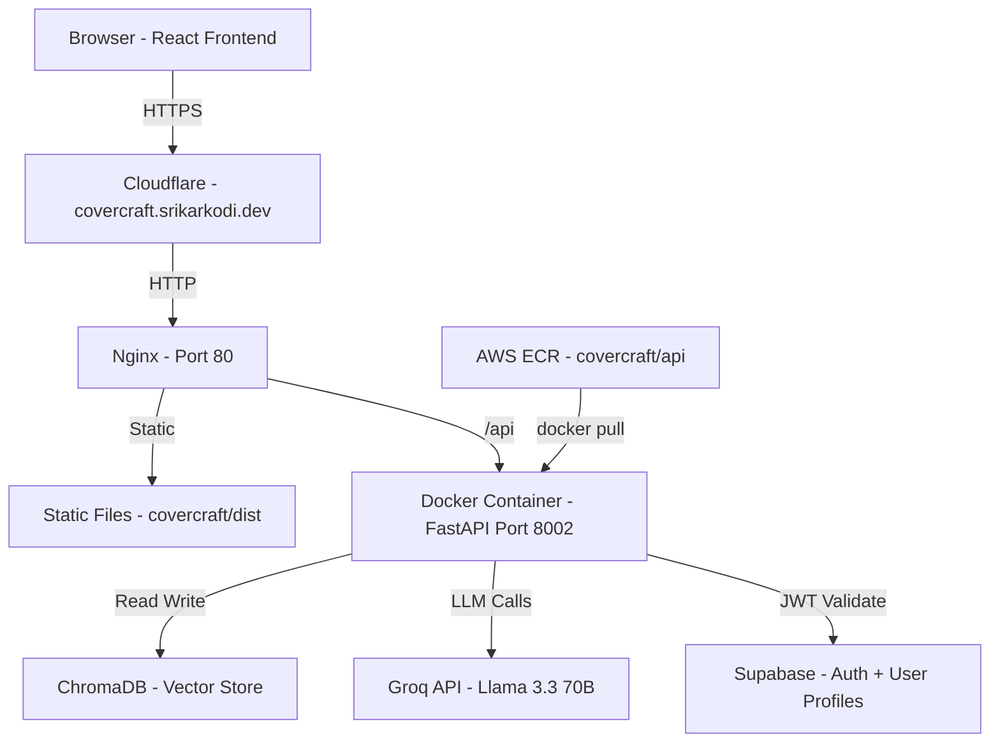
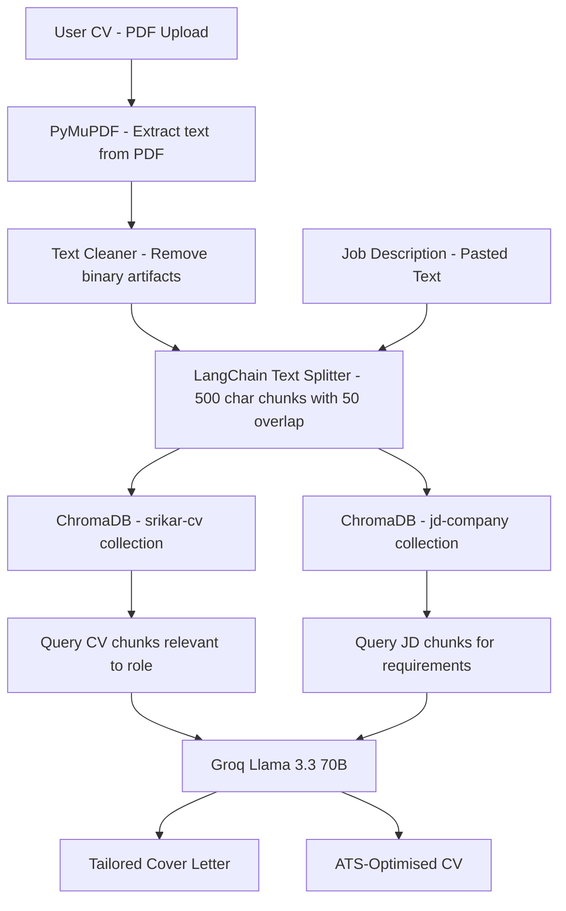
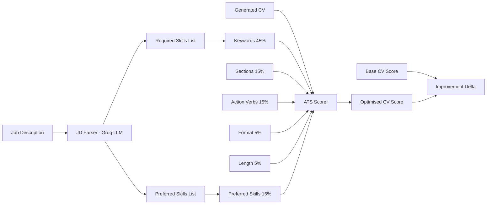
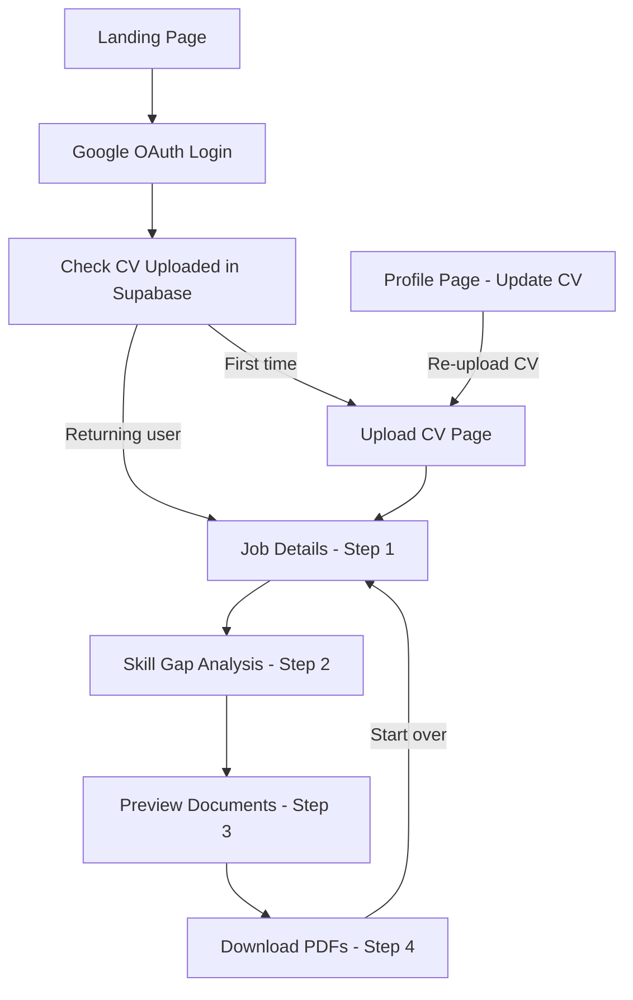
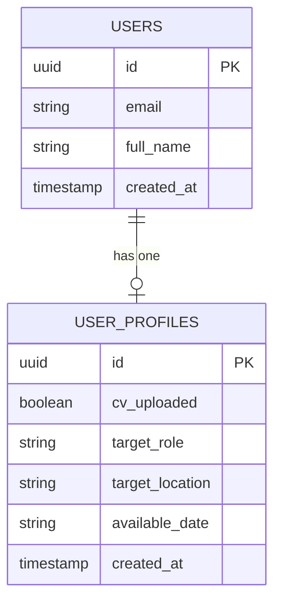

# CoverCraft — AI Cover Letter & CV Generator
### covercraft.srikarkodi.dev

> A RAG-powered document generator that creates tailored cover letters and ATS-optimised CVs from any job description. Paste a JD, get production-ready PDFs in under 30 seconds.

---

## 🌐 Live

[covercraft.srikarkodi.dev](http://covercraft.srikarkodi.dev)

---

## 🏗️ System Architecture



---

## 🔍 RAG Pipeline Flow



---

## 📊 ATS Scoring System



---

## 👤 User Flow



---

## 🗄️ Database Schema



---

## 🛠️ Tech Stack

| Layer | Technology | Purpose |
|-------|-----------|---------|
| Frontend | React 18, Vite, Tailwind CSS | UI framework |
| Routing | React Router v6 | Multi-page SPA |
| Auth | Supabase Auth + Google OAuth | User authentication |
| Backend | Python, FastAPI | REST API |
| RAG | LangChain, ChromaDB | Vector retrieval |
| PDF Parsing | PyMuPDF | Extract text from uploaded CVs |
| LLM | Llama 3.3 70B via Groq | Document generation |
| JD Parsing | Groq LLM structured output | Extract required vs preferred skills |
| PDF Generation | ReportLab | ATS-friendly PDF output |
| Containerisation | Docker, AWS ECR | Backend packaging |
| Server | AWS EC2 t3.micro | Compute |
| Web Server | Nginx | Reverse proxy |
| DNS | Cloudflare | Domain routing |

---

## ✨ Features

### Document Generation
- **Tailored cover letter** — RAG retrieves relevant CV + JD context, generates company-specific letter
- **ATS-optimised CV** — rewrites experience bullets in Google XYZ format with JD keywords injected naturally
- **Never fabricates skills** — only uses skills from the uploaded CV, never invents
- **Numbers as digits** — always 40% not "forty percent"
- **PDF download** — clean single-column ATS-friendly format

### ATS Scoring
- **Before vs after comparison** — shows base CV score vs optimised score
- **Required skills breakdown** — green ticks for matched, red crosses for missing
- **Preferred skills** — secondary match score
- **5 scoring dimensions** — keywords, sections, action verbs, format, length
- **Honest scoring** — if you don't have a skill, the score reflects that

### Skill Gap Analysis
- **Tech skills only** — filters out filler words and soft skills
- **Coverage percentage** — how much of the JD you match
- **Missing skills** — exact list of what to develop next
- **Colour coded** — green matched, red missing

### User Experience
- **4-step wizard** — Job Details → Skill Gap → Preview → Download
- **CV uploaded once** — stored in ChromaDB, reused for every application
- **Skip upload on return** — detects existing CV in Supabase, goes straight to app
- **Profile page** — update target role, location, available date, re-upload CV
- **Copy to clipboard** — copy cover letter or CV text with one click

---

## 📁 Project Structure

```
CoverCraft/
├── app/
│   └── main.py                 FastAPI routes - 8 endpoints
├── core/
│   ├── rag.py                  ChromaDB vector store + text cleaning
│   ├── cover_letter.py         RAG cover letter generator
│   ├── cv_generator.py         ATS CV rewriter with strict no-hallucination rules
│   ├── skill_gap.py            Tech skill extractor - 80+ patterns
│   ├── ats_scorer.py           ATS score calculator v2 with before/after
│   ├── jd_parser.py            LLM-based JD parser - required vs preferred skills
│   └── pdf_generator.py        ReportLab PDF renderer
├── frontend/
│   ├── src/
│   │   ├── components/
│   │   │   ├── Auth.jsx        Google login page
│   │   │   └── StepIndicator.jsx  Progress indicator
│   │   ├── pages/
│   │   │   ├── Landing.jsx     Public landing page
│   │   │   ├── CVUpload.jsx    PDF upload with PyMuPDF extraction
│   │   │   └── Profile.jsx     Profile management + CV re-upload
│   │   ├── steps/
│   │   │   ├── Step1JobDetails.jsx
│   │   │   ├── Step2SkillGap.jsx
│   │   │   ├── Step3Generate.jsx   Preview + ATS score
│   │   │   └── Step4Download.jsx   PDF downloads
│   │   ├── hooks/
│   │   │   └── useCoverCraft.js    State management for wizard
│   │   └── lib/
│   │       └── supabase.js     Supabase client
│   └── package.json
├── data/
│   └── chromadb/               Persistent vector store
├── requirements.txt
├── Dockerfile                  python:3.11-slim
└── .env                        GROQ_API_KEY
```

---

## 🔧 Running Locally

### Backend
```bash
git clone https://github.com/Namidok/CoverCraft.git
cd CoverCraft
python3.11 -m venv venv
source venv/bin/activate
pip install -r requirements.txt

echo "GROQ_API_KEY=your_key_here" > .env

GROQ_API_KEY=your_key uvicorn app.main:app --host 0.0.0.0 --port 8002 --reload
# Health check at http://localhost:8002/health
# Swagger docs at http://localhost:8002/docs
```

### Frontend
```bash
cd frontend
npm install
npm run dev
# Opens at http://localhost:3001
```

> Get a free Groq API key at [console.groq.com](https://console.groq.com)

---

## 📡 API Endpoints

| Method | Endpoint | Description |
|--------|----------|-------------|
| POST | `/upload-cv-pdf` | Upload CV as PDF - extracts text with PyMuPDF |
| POST | `/upload-cv-text` | Upload CV as plain text |
| POST | `/add-jd` | Index JD + return skill gap analysis |
| POST | `/generate-all` | Generate cover letter + CV + ATS score in one call |
| POST | `/generate-cover-letter` | Cover letter only |
| POST | `/generate-cv` | ATS CV only |
| POST | `/download-cover-letter-pdf` | Cover letter as PDF |
| POST | `/download-cv-pdf` | ATS CV as PDF |
| GET | `/health` | Health check |

---

## 🐳 Docker Deployment

```bash
# Build for Linux AMD64 and push to ECR
docker buildx build --platform linux/amd64 \
  -t 830673476818.dkr.ecr.us-east-1.amazonaws.com/covercraft/api:latest \
  --push .

# On EC2 - pull and run
docker pull 830673476818.dkr.ecr.us-east-1.amazonaws.com/covercraft/api:latest

docker run -d \
  --name covercraft-api \
  --restart always \
  -p 8002:8002 \
  -e GROQ_API_KEY=your_key \
  830673476818.dkr.ecr.us-east-1.amazonaws.com/covercraft/api:latest
```

---

## 🔄 Redeployment

```bash
# Frontend
cd frontend
npm run build
scp -i ~/skillsync-key.pem -r dist ubuntu@3.228.77.181:/home/ubuntu/covercraft/

# Backend - rebuild and push
docker buildx build --platform linux/amd64 \
  -t 830673476818.dkr.ecr.us-east-1.amazonaws.com/covercraft/api:latest --push .

# On EC2
docker stop covercraft-api && docker rm covercraft-api
docker pull 830673476818.dkr.ecr.us-east-1.amazonaws.com/covercraft/api:latest
docker run -d --name covercraft-api --restart always -p 8002:8002 \
  -e GROQ_API_KEY=your_key \
  830673476818.dkr.ecr.us-east-1.amazonaws.com/covercraft/api:latest
```

---

*Built by Srikar Kodi · MSc AI/ML · Berlin · 2026*